# SebeJJ 赛博机甲 - 技术架构图文档

> 本文档包含赛博机甲项目的完整技术架构可视化图表
> 生成时间: 2026-02-27
> 版本: 2.0

---

## 目录

1. [系统架构图](#1-系统架构图)
2. [类关系图](#2-类关系图)
3. [数据流图](#3-数据流图)
4. [模块依赖图](#4-模块依赖图)

---

## 1. 系统架构图

### 1.1 核心系统关系图

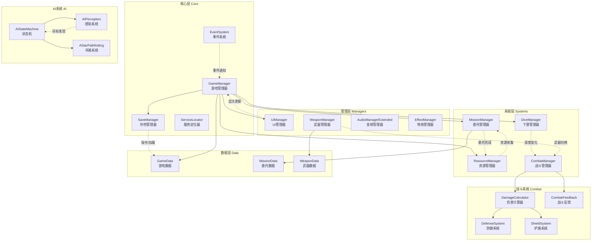

### 1.2 战斗系统架构

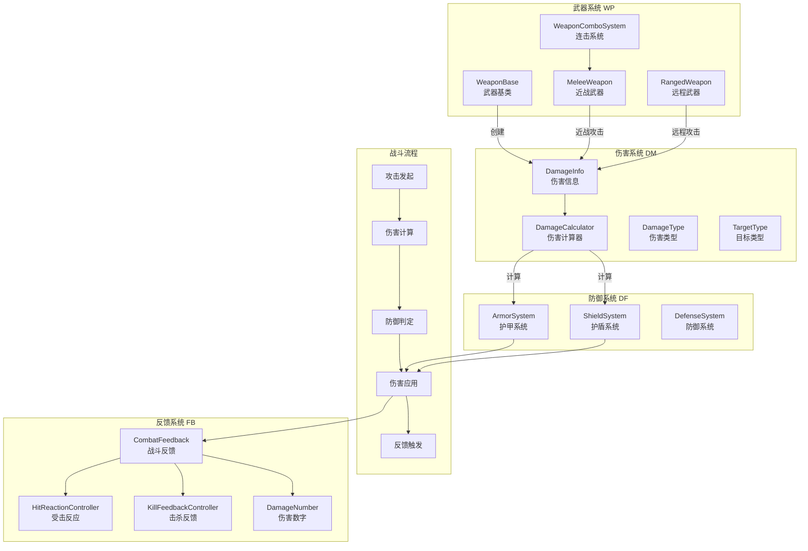

### 1.3 AI系统架构

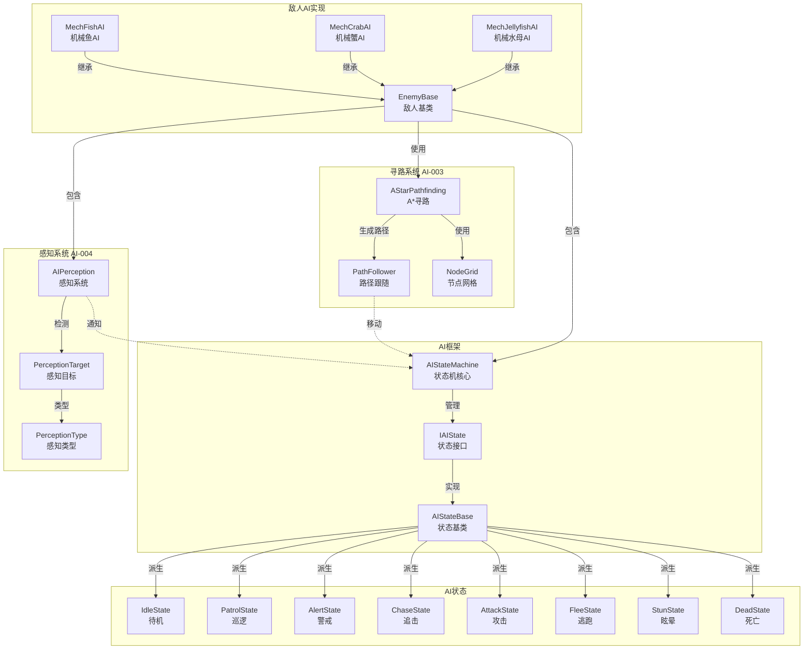

### 1.4 委托系统架构

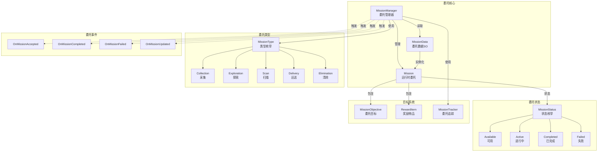

---

## 2. 类关系图

### 2.1 继承关系图

```mermaid
graph TB
    subgraph Unity["Unity基类"]
        MB[MonoBehaviour]
        SO[ScriptableObject]
    end

    subgraph CoreClasses["核心类"]
        GM[GameManager]
        SM[SaveManager]
        UM[UIManager]
        EM[EventSystem]
    end

    subgraph CombatClasses["战斗类"]
        WB[WeaponBase]
        MW[MeleeWeapon]
        RW[RangedWeapon]
        EB[EnemyBase]
    end

    subgraph AIClasses["AI类"]
        ASM[AIStateMachine]
        ASB[AIStateBase]
        IAS[IAIState<br/>接口]
    end

    subgraph DataClasses["数据类"]
        MD[MissionData]
        WD[WeaponData]
        CD[ChainsawData]
        ED[EMPData]
        PD[PlasmaCannonData]
    end

    subgraph EnemyImpl["敌人实现"]
        MFA[MechFishAI]
        MCA[MechCrabAI]
        MJA[MechJellyfishAI]
        DO[DeepOctopus]
        MS[MechShark]
    end

    subgraph BossClasses["Boss类"]
        ICB[IronClawBeastBoss]
        BS[BossStates]
        BA[BossArena]
    end

    %% Unity继承
    MB --> GM
    MB --> SM
    MB --> UM
    MB --> EM
    MB --> WB
    MB --> EB
    MB --> ASM
    
    SO --> MD
    SO --> WD
    
    %% 战斗继承
    WB --> MW
    WB --> RW
    
    %% AI继承
    IAS -->|实现| ASB
    
    %% 数据继承
    WD --> CD
    WD --> ED
    WD --> PD
    
    %% 敌人继承
    EB --> MFA
    EB --> MCA
    EB --> MJA
    EB --> DO
    EB --> MS
    EB --> ICB
```

### 2.2 接口实现图

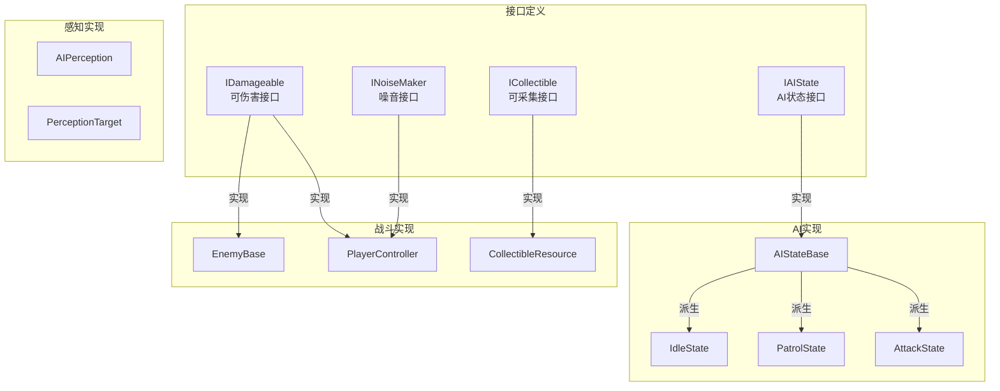

### 2.3 核心类依赖关系

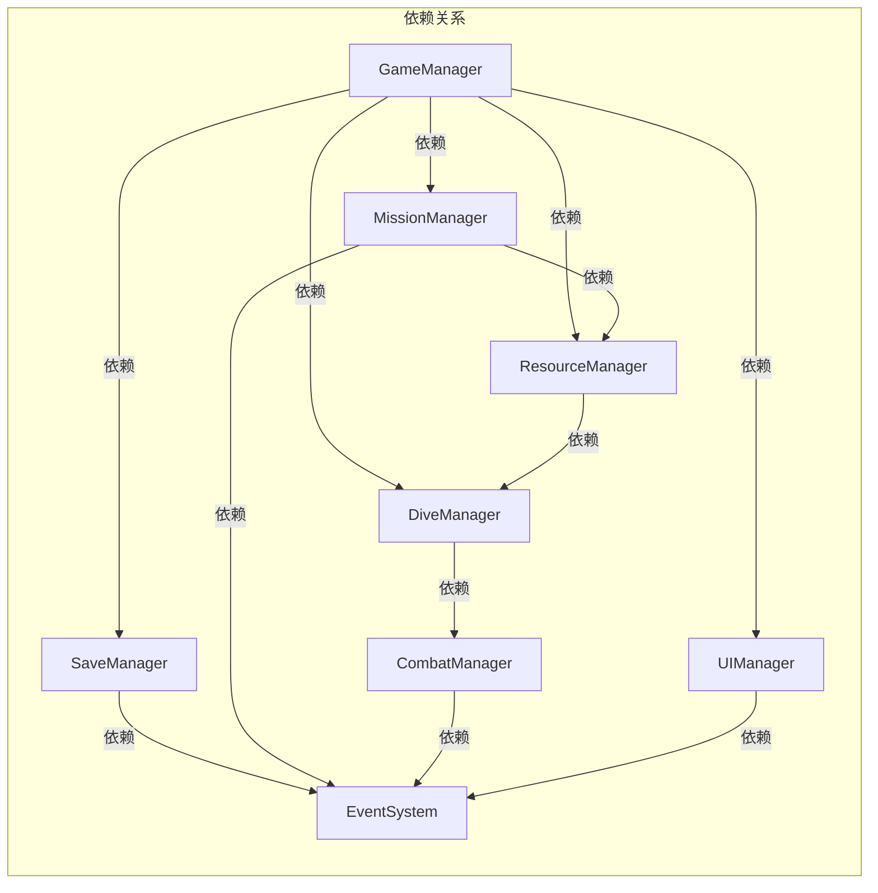

---

## 3. 数据流图

### 3.1 战斗数据流

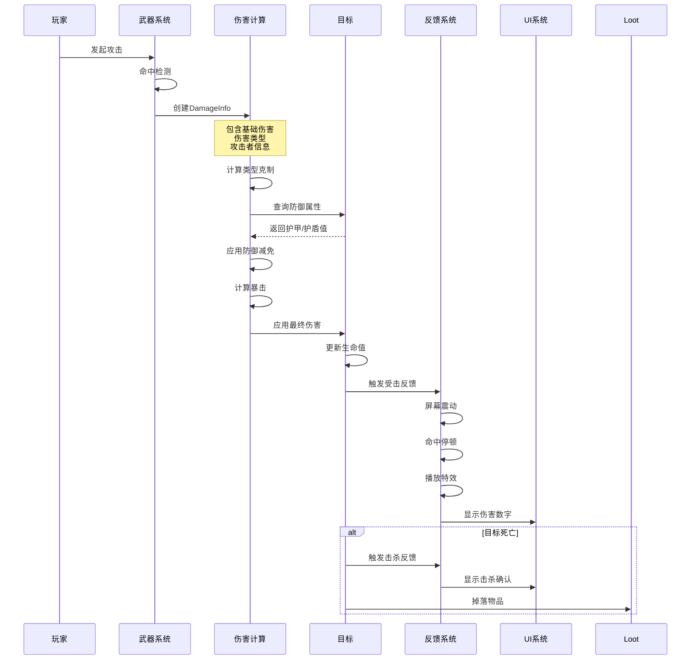

### 3.2 委托数据流

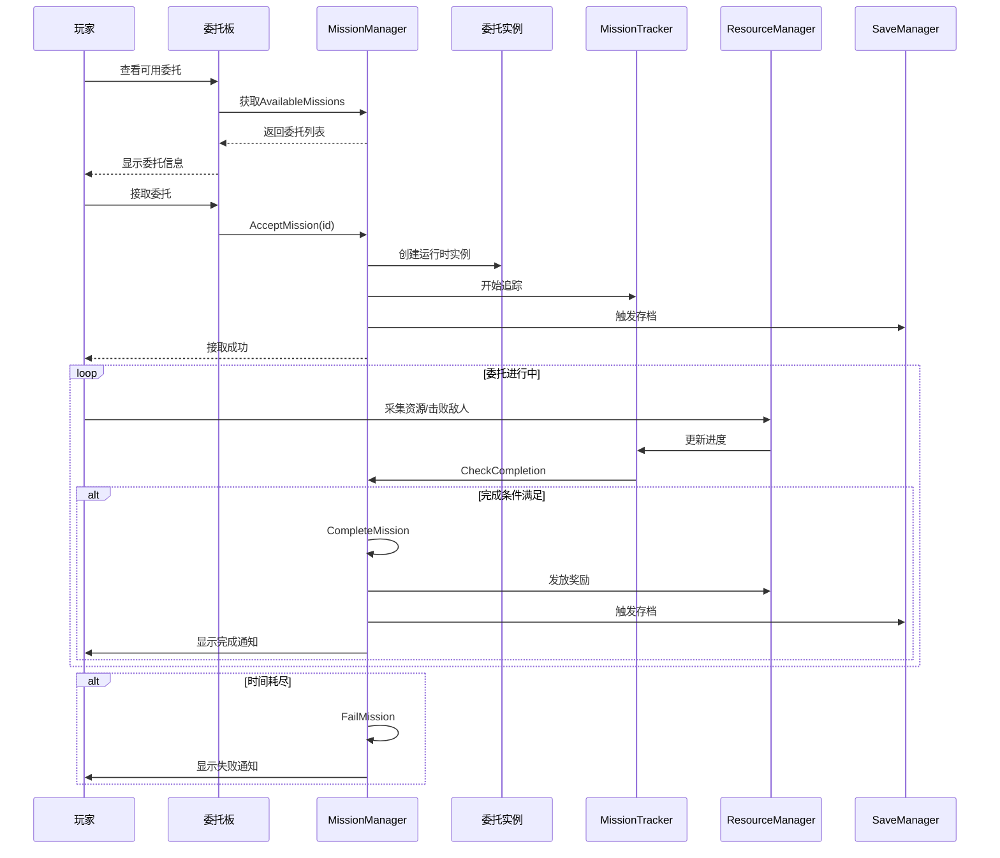

### 3.3 存档数据流

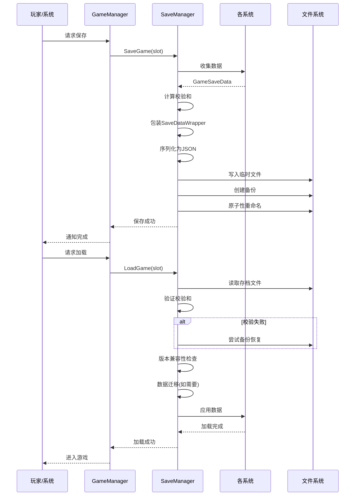

### 3.4 AI决策数据流

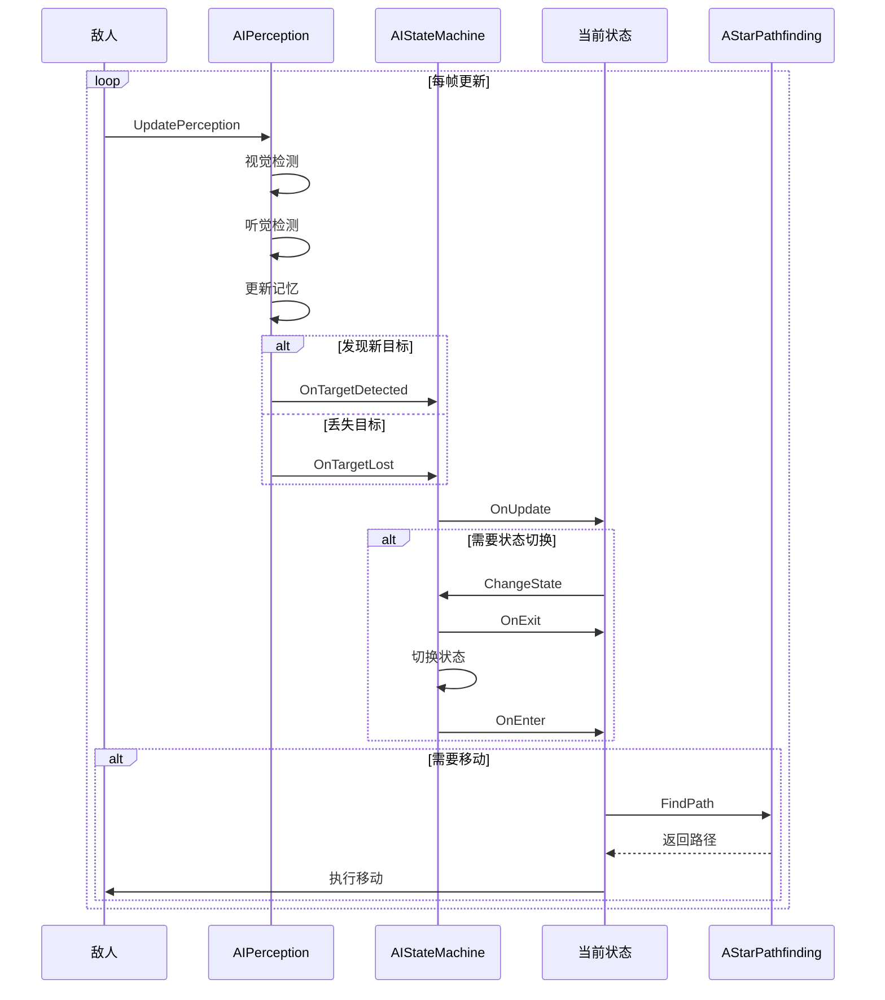

---

## 4. 模块依赖图

### 4.1 项目模块结构

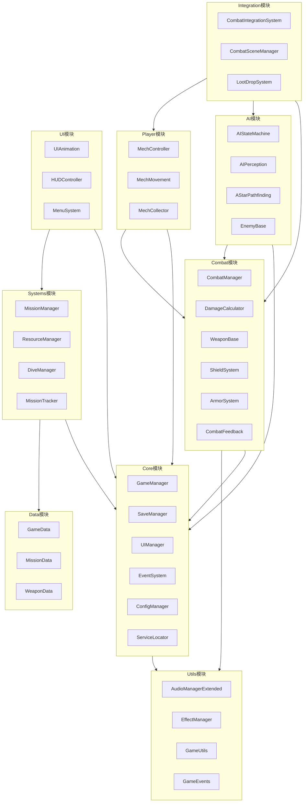

### 4.2 命名空间依赖

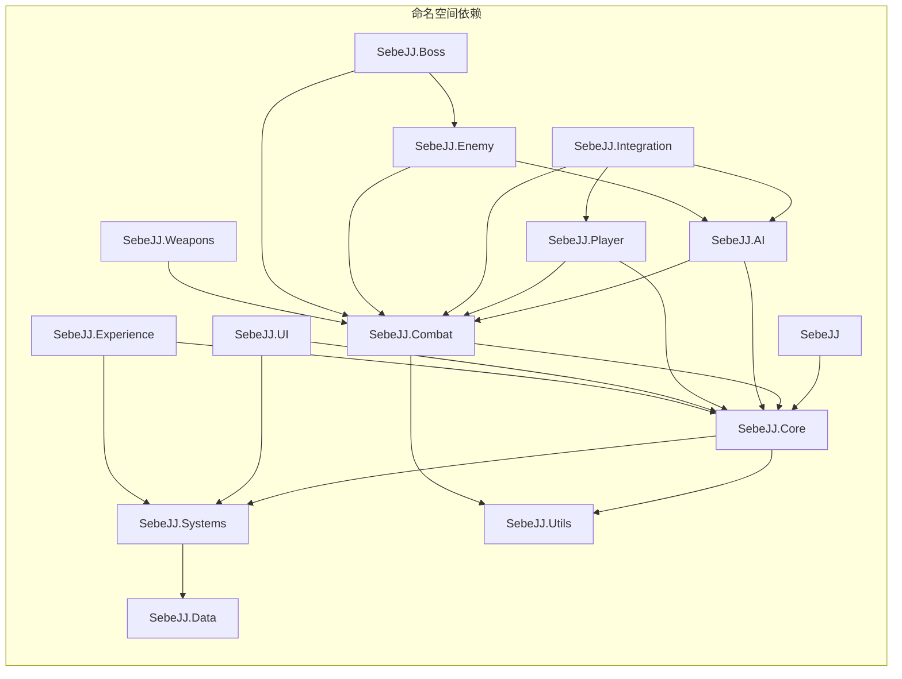

---

## 附录: 图表使用说明

### Mermaid图表渲染

本文档中的所有图表使用Mermaid语法编写，可以通过以下方式查看：

1. **GitHub/GitLab**: 原生支持Mermaid渲染
2. **VS Code**: 安装Mermaid插件
3. **在线工具**: 
   - [Mermaid Live Editor](https://mermaid.live/)
   - [Mermaid Diagram Renderer](https://mermaid.ink/)

### 图表类型说明

| 图表类型 | 用途 | 文件位置 |
|---------|------|---------|
| 系统架构图 | 展示系统间关系 | 第1节 |
| 类关系图 | 展示继承和实现 | 第2节 |
| 数据流图 | 展示数据流转 | 第3节 |
| 模块依赖图 | 展示模块关系 | 第4节 |

---

*文档版本: 2.0*
*最后更新: 2026-02-27*
*作者: 架构可视化工程师*
